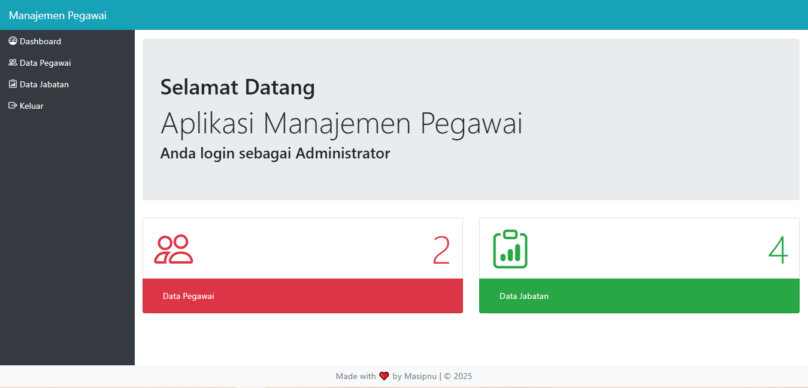

# Mengatur Halaman Dashboard

- Pada skrip sebelumnya halaman dashboard disembunyikan sementara dengan menambah tanda // pada include "konten.php".
- Untuk menampilkanya kembali hapus tanda tersebut.
- Untuk mengatur halaman dashboard akan digunakan jumbotron dan ditambah list-group untuk menampilkan jumlah data yang telah diinput.
- Sehingga skripnya berubah seperti berikut:

``File content/dashboard.php``
```php
<?php
    if (!defined('INDEX')) die("");
?>
<div class="jumbotron mt-3">
    <h1>Selamat Datang</h1>
    <h1 class="display-4">Aplikasi Manajemen Pegawai</h1>
    <h3>Anda login sebagai Administrator</h3>
</div>
<?php
    $jml_pegawai = mysqli_num_rows(mysqli_query($con, "SELECT * FROM pegawai"));
    $jml_jabatan = mysqli_num_rows(mysqli_query($con, "SELECT * FROM jabatan"));
?>
<div class="row mb-3 pb-3">
    <div class="col-sm-6 mb-3">
        <ul class="list-group">
            <li class="list-group-item text-danger">
                <i class="bi bi-people display-3"></i>
                    <span class="display-3 float-right">
                        <?=$jml_pegawai ?>
                    </span>
            </li>
            <li class="list-group-item bg-danger">
                <a href="?hal=jabatan" class="nav-link text-white">Data Pegawai</a>
            </li>
        </ul>
    </div>
    <div class="col-sm-6 mb-3">
        <ul class="list-group">
            <li class="list-group-item text-success">
                <i class="bi bi-clipboard-data display-3"></i>
                <span class="display-3 float-right">
                    <?=$jml_jabatan ?>
                </span>
            </li>
            <li class="list-group-item bg-success">
                <a href="?hal=jabatan" class="nav-link text-white">Data Jabatan</a>
            </li>
        </ul>
    </div>
</div>
```

- Skrip mengambil jumlah data dari tabel pegawai dan jabatan.
- Hasil jumlah ditampilkan dalam list group.
- Gunakan display-3 agar tampilan angka lebih besar.
- Gunakan float-right agar teks berada di sebelah kanan.
- Dan dari skrip diatas akan menghasilkan gambar seperti berikut:

