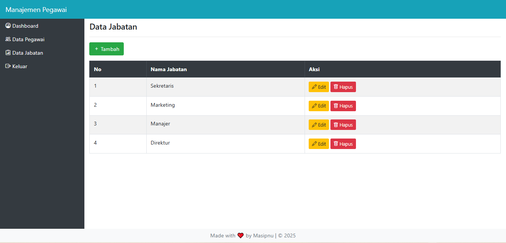

# Mengatur Tampilan Tabel

- Pada halaman jabatan maupun pegawai, tampilan tabel akan diubah menggunakan Bootstrap dan jQuery data tabel.
- Plugin ini akan membuat tampilan tabel lebih menarik disertai dengan fasilitas pencarian, pagination dan sorting.
- Pada file jabatan.php, skripnya diubah seperti berikut:

``File content/jabatan.php``
```php
<?php
if(!defined('INDEX')) die("");
?>
<h4 class="mt-2">Data Jabatan</h4>
<hr>
<a class="btn btn-success mb-3" href="?hal=jabatan_tambah">
    <i class="bi bi-plus"></i> Tambah
</a>

<div class="table-responsive">
    <table class="table table-striped table-hover table-bordered">
        <thead class="thead-dark">
            <tr>
                <th>No</th>
                <th>Nama Jabatan</th>
                <th>Aksi</th>
            </tr>
        </thead>
        <tbody>
            <?php
            $query = mysqli_query($con, "SELECT * FROM jabatan ORDER BY id_jabatan DESC");
            $no = 0;
            while($data = mysqli_fetch_array($query)){
                $no++;
            ?>
                <tr>
                    <td><?= $no ?></td>
                    <td><?= htmlspecialchars($data['nama_jabatan']) ?></td>
                    <td>
                        <a class="btn btn-sm btn-warning" href="?hal=jabatan_edit&id=<?= $data['id_jabatan'] ?>">
                            <i class="bi bi-pencil"></i> Edit
                        </a>
                        <a class="btn btn-sm btn-danger" href="?hal=jabatan_hapus&id=<?= $data['id_jabatan'] ?>" onclick="return confirm('Yakin ingin menghapus data ini?')">
                            <i class="bi bi-trash"></i> Hapus
                        </a>
                    </td>
                </tr>
            <?php
            }
            ?>
        </tbody>
    </table>
</div>
```

- Tabel diberikan class untuk tampilan lebih baik.
- Tombol tambah, edit, dan hapus menggunakan class btn dengan warna berbeda.
- Ikon ditambahkan untuk tampilan lebih menarik.
- Menerapkan plugin DataTable:
- Download dari DataTables.net.
- Buat folder plugin dan pindahkan folder dist dari DataTable ke dalamnya.
- Ubah nama folder dist menjadi DataTable.
- Gunakan style DataTable untuk Bootstrap 4.
- Panggil file style di bagian head pada index.php sebagai berikut:

``File Index.php``
```html
<link href="plugin/DataTables/css/dataTables.bootstrap4.min.css" rel="stylesheet">
```

- Selanjutnya, panggil file plugin jQuery di bagian bawah setelah pemanggilan skrip jQuery, serta buat skrip untuk menerapkan plugin DataTable seperti berikut:

``File Index.php``
```html
<script src="plugin/DataTables/js/jquery.dataTables.min.js"></script>
<script src="plugin/DataTables/js/dataTables.bootstrap4.min.js"></script>

<script>
    $(function(){
        $('.table').DataTable();
    });
</script>
```

- File yang dipanggil ada 2, yaitu file core dari plugin DataTable dan file skrip khusus untuk integrasi dengan Bootstrap. Cara menerapkannya ke tabel dapat dilihat pada skrip yang dicetak tebal. Hasilnya akan seperti gambar berikut:
