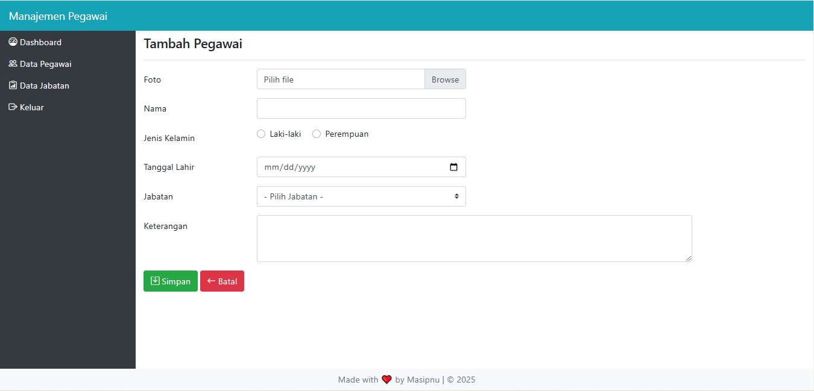

# Mengatur Tampilan Form

- Pada form tambah dan edit jabatan hanya menerapkan style Bootsrtap, penulis yakin pembaca yakin tidak kesulitan mengubahnya.
- Pada form tambah dan edit pegawai, akan menggunakan style Bootstrap dengan berbagai jenis custom control, serta menggunakan plugin jQuery Bootstrap-datepicker yang dapat di download di https://github.com/uxsolutions/bootstrap-datepicker dan plugin summernote untuk mengubah textarea dengan penambahan berbagai tool pengeditan teks yang dapat di donwload di https://summernote.org.
- Pada file pegawai_tambah.php, skripnya berubah menjadi seperti berikut:

``File content/pegawai_tambah.php``
```php
<?php
if(!defined('INDEX')) die("");
?>

<h4 class="mt-2">Tambah Pegawai</h4>
<hr>

<form class="mb-5" method="post" action="?hal=pegawai_insert" enctype="multipart/form-data">
    <div class="form-group row">
        <label for="foto" class="col-sm-2 col-form-label">Foto</label>
        <div class="col-sm-4">
            <div class="custom-file">
                <input type="file" class="custom-file-input" id="foto" name="foto">
                <label class="custom-file-label" for="foto">Pilih file</label>
            </div>
        </div>
    </div>

    <div class="form-group row">
        <label for="nama" class="col-sm-2 col-form-label">Nama</label>
        <div class="col-sm-4">
            <input type="text" class="form-control" id="nama" name="nama" required>
        </div>
    </div>

    <div class="form-group row">
        <label class="col-sm-2 col-form-label">Jenis Kelamin</label>
        <div class="col-sm-4">
            <div class="custom-control custom-radio custom-control-inline">
                <input type="radio" class="custom-control-input" id="jk_l" name="jk" value="L" required>
                <label class="custom-control-label" for="jk_l">Laki-laki</label>
            </div>
            <div class="custom-control custom-radio custom-control-inline">
                <input type="radio" class="custom-control-input" id="jk_p" name="jk" value="P" required>
                <label class="custom-control-label" for="jk_p">Perempuan</label>
            </div>
        </div>
    </div>

    <div class="form-group row">
        <label for="tanggal" class="col-sm-2 col-form-label">Tanggal Lahir</label>
        <div class="col-sm-4">
            <input type="date" class="form-control" id="tanggal" name="tanggal" required>
        </div>
    </div>

    <div class="form-group row">
        <label for="jabatan" class="col-sm-2 col-form-label">Jabatan</label>
        <div class="col-sm-4">
            <select class="custom-select" id="jabatan" name="jabatan" required>
                <option value="">- Pilih Jabatan -</option>
                <?php
                $query_jabatan = mysqli_query($con, "SELECT * FROM jabatan");
                while($jabatan = mysqli_fetch_array($query_jabatan)) {
                    echo "<option value='".$jabatan['id_jabatan']."'>".$jabatan['nama_jabatan']."</option>";
                }
                ?>
            </select>
        </div>
    </div>

    <div class="form-group row">
        <label for="keterangan" class="col-sm-2 col-form-label">Keterangan</label>
        <div class="col-sm-8">
            <textarea class="form-control" id="keterangan" name="keterangan" rows="3" required></textarea>
        </div>
    </div>

    <div class="form-group row">
        <div class="col-sm-10">
            <button type="submit" class="btn btn-success"><i class="bi bi-save"></i> Simpan</button>
            <a href="?hal=pegawai" class="btn btn-danger"><i class="bi bi-arrow-left"></i> Batal</a>
        </div>
    </div>
</form>
```

- Pada skrip di atas, disertai beberapa contoh penggunaan custom control yaitu pada input file, input radio, dan select. Perhatikan saja pada class-class yang dicetak tebal.
- Untuk menerapkan plugin bootstrap-datepicker dan summernote, seperti biasa panggil file style pada bagian head dan panggil skrip plugin pada bagian bawah beserta penerapannya pada file index.php. Perhatikan skrip berikut:

``File index.php``
```html

<link href="plugin/bootstrap-datepicker/css/bootstrap-datepicker3.min.css" rel="stylesheet">
<link href="plugin/summernote/summernote-bs4.css" rel="stylesheet">

<script src="plugin/bootstrap-datepicker/js/bootstrap-datepicker.min.js"></script>
<script src="plugin/summernote/summernote-bs4.min.js"></script>

<script>
    $(function(){
        $('.table').DataTable();
        $('#tanggal').datepicker();
        $('#keterangan').summernote();
    });
</script>
```

- Pemanggilan file style dan skrip plugin setelah pemanggilan style dan skrip plugin sebelumnya. Hasilnya seperti berikut:
